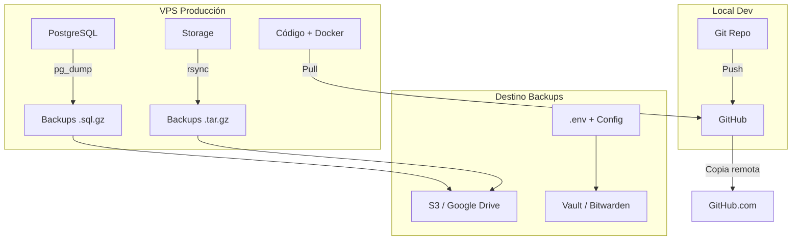
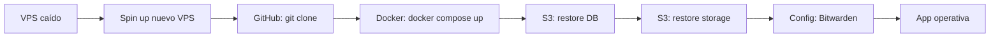

# ================================================================
# SendMe Studio — Backup Strategy
# ================================================================
# Fecha: Junio 2026
# Versión: v0.1.0
# ================================================================

## Arquitectura de Backups



---

## 1. Backup de Código — GitHub

### Estrategia

| Elemento | Método | Frecuencia |
|----------|--------|------------|
| Código fuente | Git push | Cada commit |
| Releases | Tags semánticos | Cada release |
| Ramas | GitFlow (main + develop) | Continuo |

### Automatización

El CI pipeline (`ci.yml`) ya verifica que el código compile antes de aceptar un PR.

### Seguridad

- Repositorio: **privado**
- Acceso: solo desarrolladores autorizados
- 2FA obligatorio en GitHub

---

## 2. Backup de Base de Datos — PostgreSQL

### Script de Backup Diario

```bash
#!/bin/bash
# /opt/sendmestudio/scripts/backup-db.sh

TIMESTAMP=$(date +%Y%m%d_%H%M%S)
BACKUP_DIR="/var/backups/sendmestudio/postgres"
DB_NAME="sendmestudio"
DB_USER="sendme_user"
DB_HOST="localhost"
BUCKET="s3://sendmestudio-backups/postgres/"

# Crear directorio
mkdir -p $BACKUP_DIR

# Dump con compresión
pg_dump -h $DB_HOST -U $DB_USER -d $DB_NAME -F c \
  --no-owner --no-acl \
  -f "$BACKUP_DIR/${DB_NAME}_${TIMESTAMP}.dump"

# Comprimir
gzip "$BACKUP_DIR/${DB_NAME}_${TIMESTAMP}.dump"

# Subir a S3
aws s3 cp "$BACKUP_DIR/${DB_NAME}_${TIMESTAMP}.dump.gz" \
  "$BUCKET${DB_NAME}_${TIMESTAMP}.dump.gz" \
  --storage-class STANDARD_IA

# Limpiar backups locales viejos (>7 días)
find $BACKUP_DIR -name "*.dump.gz" -mtime +7 -delete
```

### Configurar Cron

```bash
# Todos los días a las 3:00 AM
0 3 * * * /opt/sendmestudio/scripts/backup-db.sh >> /var/log/sendmestudio/backup.log 2>&1
```

### Retención

| Tipo | Retención | Destino |
|------|-----------|---------|
| Diario | 7 días | Local + S3 |
| Semanal | 4 semanas | S3 |
| Mensual | 12 meses | S3 (Glacier) |

### Restore

```bash
# Restore desde archivo local
pg_restore -h localhost -U sendme_user -d sendmestudio \
  --clean --if-exists \
  /var/backups/sendmestudio/postgres/sendmestudio_20260610_030000.dump

# Restore desde S3
aws s3 cp s3://sendmestudio-backups/postgres/sendmestudio_20260610_030000.dump.gz .
gunzip sendmestudio_20260610_030000.dump.gz
pg_restore -h localhost -U sendme_user -d sendmestudio \
  --clean --if-exists \
  sendmestudio_20260610_030000.dump
```

---

## 3. Backup de Storage (Archivos)

### Qué se respalda

| Directorio | Contenido | Tamaño estimado |
|------------|-----------|-----------------|
| `data/customer-assets/` | Imágenes de clientes | Variable |
| `data/conversations/` | Archivos JSON de conversaciones | Medio |
| `data/knowledge/` | Base de conocimiento | Bajo |
| `data/business-brain/` | Datos de business brain | Bajo |
| `prisma/.env.bak` | Backup de .env interno | Muy bajo |

### Script de Backup

```bash
#!/bin/bash
# /opt/sendmestudio/scripts/backup-storage.sh

TIMESTAMP=$(date +%Y%m%d_%H%M%S)
BACKUP_DIR="/var/backups/sendmestudio/storage"
SOURCE_DIR="/opt/sendmestudio/data"
BUCKET="s3://sendmestudio-backups/storage/"

mkdir -p $BACKUP_DIR

# Comprimir data directory
tar -czf "$BACKUP_DIR/data_${TIMESTAMP}.tar.gz" \
  -C /opt/sendmestudio data/

# Subir a S3
aws s3 cp "$BACKUP_DIR/data_${TIMESTAMP}.tar.gz" \
  "$BUCKET/data_${TIMESTAMP}.tar.gz" \
  --storage-class STANDARD_IA

# Limpiar locales viejos
find $BACKUP_DIR -name "*.tar.gz" -mtime +3 -delete
```

### Restore

```bash
# Restore storage
aws s3 cp s3://sendmestudio-backups/storage/data_20260610_030000.tar.gz .
tar -xzf data_20260610_030000.tar.gz -C /opt/sendmestudio
```

---

## 4. Backup de Configuración

### Qué se respalda

| Archivo | Dónde guardar |
|---------|---------------|
| `.env.production` | Bitwarden / Vault |
| `.env.example` | GitHub (ya está) |
| `docker-compose.yml` | GitHub (ya está) |
| Nginx config | GitHub + Bitwarden |
| SSL certs | Certbot + Bitwarden |

### Recomendación

- Usar **Bitwarden** o **HashiCorp Vault** para almacenar secrets
- No versionar `.env` reales en Git
- Documentar en `.env.example` las variables necesarias

---

## 5. Backup de Docker Images

```bash
# Backup de imágenes Docker
docker save sendmestudio_app:latest -o sendmestudio_app_latest.tar
gzip sendmestudio_app_latest.tar

# Subir a S3
aws s3 cp sendmestudio_app_latest.tar.gz \
  s3://sendmestudio-backups/docker/

# En otro servidor, cargar
gunzip sendmestudio_app_latest.tar.gz
docker load -i sendmestudio_app_latest.tar
```

---

## 6. Plan de Recuperación ante Desastres

### Escenario 1: Fallo de VPS



### Paso a paso

1. **Provisionar nuevo VPS** (mismo provider o diferente)
2. **Instalar dependencias**: Docker, Docker Compose, Git, AWS CLI
3. **Clonar repositorio**:
   ```bash
   git clone https://github.com/TU_USUARIO/sendmestudio.git
   git checkout main
   ```
4. **Configurar .env** desde Bitwarden/Vault
5. **Restore DB** desde S3
6. **Restore storage** desde S3
7. **Iniciar app**:
   ```bash
   docker compose up -d
   ```
8. **Configurar Nginx + SSL**:
   ```bash
   sudo certbot --nginx -d sendmestudio.com
   ```
9. **Verificar health**:
   ```bash
   curl https://sendmestudio.com/api/health
   ```

### Tiempo estimado de recuperación: **15-30 minutos**

---

## 7. Automatización Completa

### Script Unificado (opcional)

```bash
#!/bin/bash
# /opt/sendmestudio/scripts/full-backup.sh

echo "=== SendMe Studio Full Backup ==="
echo "Timestamp: $(date)"

# 1. Backup DB
/opt/sendmestudio/scripts/backup-db.sh

# 2. Backup storage
/opt/sendmestudio/scripts/backup-storage.sh

# 3. Verificar integridad
echo "Verificando backups..."
ls -lh /var/backups/sendmestudio/postgres/
ls -lh /var/backups/sendmestudio/storage/

echo "=== Backup completo ==="
```

### Monitoreo

- Verificar logs diarios: `cat /var/log/sendmestudio/backup.log`
- Alertar si backup falla: integrar con sistema de monitoreo
- Probar restore al menos una vez al mes

---

## Resumen de Estrategia

| Componente | Método | Frecuencia | Retención | RTO | RPO |
|------------|--------|------------|-----------|-----|-----|
| Código | Git (GitHub) | Por commit | Permanente | < 1h | < 1min |
| PostgreSQL | pg_dump → S3 | Diaria | 7d local / 12m S3 | 30 min | 24h |
| Storage | tar.gz → S3 | Diaria | 3d local / 12m S3 | 30 min | 24h |
| Config | Bitwarden | Manual | Permanente | 15 min | Manual |
| Docker | docker save → S3 | Semanal | 1m S3 | 30 min | 7d |
