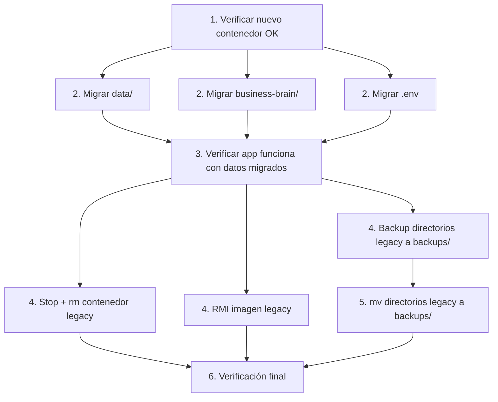

# ================================================================
# SendMe Studio — Legacy Rename Plan
# ================================================================
# Versión: v0.1.0
# Fecha: Junio 2026
# Contexto: Post-deploy limpio, migrar nombres heredados
# ================================================================

## Resumen de la operación

| Concepto | Legacy (a eliminar) | Nuevo estándar |
|----------|--------------------|----------------|
| Container | `salon_belleza_app_1` | `sendmestudio_app` |
| Imagen Docker | `salon_belleza_app:latest` | `sendmestudio_app:latest` |
| Data dir | `/opt/sendmestudio/Salon_Belleza/data` | `/opt/sendmestudio/app/data` (via repo) |
| Business brain | `/opt/sendmestudio/Salon_Belleza/business-brain` | `/opt/sendmestudio/app/business-brain` (via repo) |
| Docker Compose | No existía (manual) | `docker-compose.yml` versionado |

---

## 1. Inventario de elementos legacy

### 1.1 Contenedor e imagen

```bash
# Identificar contenedor legacy
docker ps -a --filter "name=salon_belleza" --format "table {{.Names}}\t{{.Image}}\t{{.Status}}"

# Identificar imagen legacy
docker images --filter "reference=salon_belleza*" --format "table {{.Repository}}\t{{.Tag}}\t{{.ID}}"

# Verificar volúmenes asociados
docker inspect salon_belleza_app_1 --format '{{json .Mounts}}' 2>/dev/null | python3 -m json.tool || echo "No existe"
```

### 1.2 Directorios legacy

```bash
# Listar todo lo legacy
ls -la /opt/sendmestudio/Salon_Belleza/ 2>/dev/null || echo "No existe Salon_Belleza"
ls -la /opt/sendmestudio/liquid-glass*/ 2>/dev/null || echo "No existe liquid-glass"
```

---

## 2. Qué NO debe borrarse

| Elemento | Motivo | Acción |
|----------|--------|--------|
| `/opt/sendmestudio/backups/` | Contiene backups del deploy anterior | Conservar |
| `data/` dentro de `Salon_Belleza` | Datos de clientes, conversaciones, assets | Migrar a repo |
| `business-brain/` dentro de `Salon_Belleza` | Conocimiento del negocio, patrones | Migrar a repo |
| `.env.production` del backup | Variables de entorno de producción | Reutilizar |
| Cualquier tar.gz | Posible backup valioso | Conservar en backups/ |

---

## 3. Migración de datos legacy a repo

### 3.1 Migrar data/

```bash
# Solo si el nuevo repo ya está clonado en /opt/sendmestudio/app
# y el contenedor nuevo ya está funcionando

# Backup de data legacy si no existe ya
if [ -d /opt/sendmestudio/Salon_Belleza/data ] && [ ! -d /opt/sendmestudio/app/data ]; then
  cp -r /opt/sendmestudio/Salon_Belleza/data /opt/sendmestudio/app/data
  echo "✅ data/ migrado a /opt/sendmestudio/app/data"
fi

# Verificar integridad
diff -rq /opt/sendmestudio/Salon_Belleza/data /opt/sendmestudio/app/data 2>/dev/null && \
  echo "✅ data íntegro" || echo "⚠ diferencias encontradas"
```

### 3.2 Migrar business-brain/

```bash
# Solo si el nuevo repo ya está clonado y funcionando

if [ -d /opt/sendmestudio/Salon_Belleza/business-brain ] && [ ! -d /opt/sendmestudio/app/business-brain ]; then
  cp -r /opt/sendmestudio/Salon_Belleza/business-brain /opt/sendmestudio/app/business-brain
  echo "✅ business-brain/ migrado"
fi
```

### 3.3 Migrar .env

```bash
# Copiar .env si no existe en el nuevo repo
if [ ! -f /opt/sendmestudio/app/.env.production ] && [ -f /opt/sendmestudio/Salon_Belleza/.env ]; then
  cp /opt/sendmestudio/Salon_Belleza/.env /opt/sendmestudio/app/.env.production
  echo "✅ .env.production creado desde legacy"
fi
```

---

## 4. Limpieza de Docker legacy (post-migración)

### 4.1 Eliminar contenedor legacy (solo después de verificar que el nuevo funciona)

```bash
# ⚠ Solo ejecutar cuando sendmestudio_app esté funcionando correctamente
# y sirviendo tráfico en https://app.sendmestudio.com

# Verificar que el nuevo contenedor está activo
docker ps --format "{{.Names}}" | grep -q sendmestudio_app || {
  echo "⚠ sendmestudio_app no está activo. Cancelando limpieza."
  exit 1
}

# Verificar que el nuevo sirve tráfico
curl -s -o /dev/null -w "%{http_code}" http://localhost:3000 | grep -q 200 || {
  echo "⚠ El nuevo contenedor no responde 200. Cancelando limpieza."
  exit 1
}

# --- Limpieza segura ---

# Detener contenedor legacy (si aún existe)
docker stop salon_belleza_app_1 2>/dev/null && echo "✅ salon_belleza_app_1 detenido"

# Eliminar contenedor legacy
docker rm salon_belleza_app_1 2>/dev/null && echo "✅ salon_belleza_app_1 eliminado"

# Eliminar imagen legacy (solo si el nombre no es necesario para rollback)
docker rmi salon_belleza_app:latest 2>/dev/null && echo "✅ salon_belleza_app:latest eliminada"
```

### 4.2 Limpiar imágenes no utilizadas (opcional)

```bash
# Limpiar imágenes colgantes (dangling)
docker image prune -f

# Limpiar contenedores detenidos
docker container prune -f

# No usar docker system prune -a porque eliminaría imágenes cacheadas
```

---

## 5. Limpieza de directorios legacy (post-migración)

### 5.1 Mover a backups/ en lugar de borrar

```bash
# Mover a backups en vez de borrar directamente
BACKUP_LEGACY="/opt/sendmestudio/backups/legacy-dirs-$(date +%Y%m%d-%H%M%S)"
mkdir -p "$BACKUP_LEGACY"

# Mover directorios legacy
mv /opt/sendmestudio/Salon_Belleza "$BACKUP_LEGACY/" 2>/dev/null && \
  echo "✅ Salon_Belleza movido a $BACKUP_LEGACY"

# Mover otros legacy
mv /opt/sendmestudio/liquid-glass* "$BACKUP_LEGACY/" 2>/dev/null || true
mv /opt/sendmestudio/*.tar.gz "$BACKUP_LEGACY/" 2>/dev/null || true

# Verificar
echo "Backup legacy en: $BACKUP_LEGACY"
ls -la "$BACKUP_LEGACY"
```

### 5.2 Verificar que la app sigue funcionando después de la limpieza

```bash
curl -s -o /dev/null -w "%{http_code}" https://app.sendmestudio.com/api/health
# Debe seguir respondiendo 200
```

---

## 6. Plan de Rollback (si algo sale mal)

### 6.1 Rollback de datos migrados

```bash
# Si la migración de datos rompió algo
cd /opt/sendmestudio/app
rm -rf data
rm -rf business-brain
# Devolver los originales
cp -r /opt/sendmestudio/backups/app-manual-legacy-*/data ./
cp -r /opt/sendmestudio/backups/app-manual-legacy-*/business-brain ./
docker compose restart
```

### 6.2 Rollback de limpieza Docker

```bash
# Si se necesita el contenedor legacy de vuelta
# (solo si la imagen aún existe)
docker run -d --name salon_belleza_app_1 \
  -p 3000:3000 \
  -v /opt/sendmestudio/backups/legacy-dirs-*/Salon_Belleza/data:/app/data \
  salon_belleza_app:latest 2>/dev/null || \
  echo "⚠ Imagen legacy ya no existe. Usar backup tar.gz"
```

### 6.3 Rollback de directorios legacy

```bash
# Restaurar directorios desde backup
BACKUP_LEGACY=$(ls -d /opt/sendmestudio/backups/legacy-dirs-* 2>/dev/null | tail -1)
if [ -n "$BACKUP_LEGACY" ] && [ -d "$BACKUP_LEGACY/Salon_Belleza" ]; then
  cp -r "$BACKUP_LEGACY/Salon_Belleza" /opt/sendmestudio/
  echo "✅ Salon_Belleza restaurado"
fi
```

---

## 7. Orden de ejecución recomendado



---

## 8. Checklist de verificación final

```bash
echo "========== VERIFICACIÓN POST-LIMPIEZA =========="
echo ""

echo "1. Contenedores activos:"
docker ps --format "table {{.Names}}\t{{.Image}}\t{{.Status}}"
echo ""

echo "2. Imágenes Docker:"
docker images --format "table {{.Repository}}\t{{.Tag}}"
echo ""

echo "3. Directorios en /opt/sendmestudio:"
ls -la /opt/sendmestudio/
echo ""

echo "4. app.sendmestudio.com:"
curl -s -o /dev/null -w "HTTP %{http_code}\n" https://app.sendmestudio.com
echo ""

echo "5. Health API:"
curl -s https://app.sendmestudio.com/api/health | head -5
echo ""

echo "6. Espacio liberado:"
df -h /opt/sendmestudio/
echo ""

echo "7. Resumen de legacy eliminado:"
echo "  - salon_belleza_app_1:       $(docker ps -a --filter name=salon_belleza --format 'EXISTS' 2>/dev/null || echo 'ELIMINADO ✅')"
echo "  - salon_belleza_app:latest:  $(docker images --filter reference=salon_belleza --format 'EXISTS' 2>/dev/null || echo 'ELIMINADO ✅')"
echo "  - /opt/Salon_Belleza/:       $(ls -d /opt/sendmestudio/Salon_Belleza 2>/dev/null || echo 'ELIMINADO ✅')"
echo "  - /opt/liquid-glass/:        $(ls -d /opt/sendmestudio/liquid-glass* 2>/dev/null || echo 'ELIMINADO ✅')"

echo ""
echo "✅ Limpieza legacy completada"
```

---

## 9. Tabla resumen

| Elemento | Acción | Cuándo | Rollback |
|----------|--------|--------|----------|
| `salon_belleza_app_1` | `docker stop + rm` | Después de verificar nuevo contenedor | Solo si imagen existe |
| `salon_belleza_app:latest` | `docker rmi` | Después de verificar | Desde backup tar.gz |
| `Salon_Belleza/data` | `cp` a repo | Inmediatamente después del deploy | `cp` desde backups/ |
| `Salon_Belleza/business-brain` | `cp` a repo | Inmediatamente después del deploy | `cp` desde backups/ |
| `Salon_Belleza/.env` | Copiar a `.env.production` | Durante deploy | Conservar en backups/ |
| Directorio `Salon_Belleza` | `mv` a `backups/legacy-dirs-*` | Después de migrar datos | `mv` de vuelta |
| tar.gz legacy | `mv` a `backups/legacy-dirs-*` | Al final | `mv` de vuelta |
