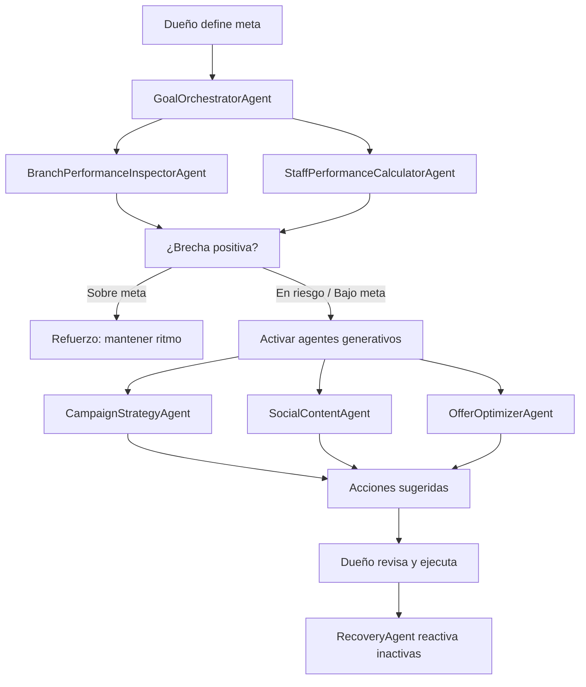

# Motor de Crecimiento — Growth Engine

> **Estado:** Concepto — No implementar aún
> **Versión:** 1.0
> **Creado:** 2026-05-31

---

## Visión General

Módulo premium impulsado por IA que ayuda al dueño del salón a alcanzar metas comerciales. El usuario define una meta (ej: $8.000.000 mensuales, 300 reservas, 80 balayage, 90% ocupación, 50 clientas reactivadas) y el sistema analiza el estado actual, calcula la brecha y propone acciones concretas.

---

## Modo Premium: Training AI Mode

Cuando está **activo** (costo adicional):
- La IA no solo analiza, sino que recomienda rutas de acción.
- Acelera al salón hacia la meta.
- Genera campañas, textos, cupones y acciones sugeridas.
- Puede aprender de resultados anteriores.

Cuando está **desactivado**:
- Solo muestra métricas e insights.
- No orquesta acciones automáticas.

---

## Agentes Propuestos

### 1. BranchPerformanceInspectorAgent
**Inspector de desempeño de sucursal**

- Revisa rendimiento general del local.
- Detecta si la sucursal va sobre meta, bajo meta o en riesgo.
- Lee: agenda, campañas, ingresos estimados, conversiones, cancelaciones.

### 2. StaffPerformanceCalculatorAgent
**Calculador de desempeño de profesionales**

- Calcula rendimiento por estilista/profesional.
- Métricas: pedidos asignados, completados, cancelados, valor generado, ocupación, cumplimiento de meta, índice interno.

### 3. GoalOrchestratorAgent
**Orquestador de metas**

- Toma la meta definida por el dueño.
- La divide en pasos operativos.
- Calcula brecha: `meta - resultado actual`.
- Decide qué acciones ejecutar o sugerir.

### 4. CampaignStrategyAgent
**Estratega de campañas**

- Sugiere campañas WhatsApp.
- Sugiere audiencias objetivo.
- Sugiere descuentos/cupones.
- Sugiere servicios prioritarios.

### 5. SocialContentAgent
**Agente de contenido**

- Crea textos para redes sociales.
- Crea posts para Instagram / Facebook.
- Crea promociones alineadas a la meta.

### 6. OfferOptimizerAgent
**Optimizador de ofertas**

- Recomienda descuentos.
- Crea paquetes.
- Sugiere cupones.
- Evita descuentos excesivos si el margen no lo permite.

### 7. RecoveryAgent
**Agente de recuperación (existente en backend)**

- Reactiva clientas inactivas.
- Debe integrarse al flujo del Growth Engine.

---

## Flujo Propuesto (Training AI Mode activo)

---

## UI — Módulo Visible: "Motor de Crecimiento"

Ruta futura sugerida: dentro de Marketing o Inteligencia.

### Secciones del panel

1. **Meta del local**
   - Meta mensual: $8.000.000
   - Avance actual: $3.200.000
   - Brecha: $4.800.000
   - Días restantes: 12

2. **Estado de la sucursal**
   - Sobre meta ✅
   - En ruta 🟢
   - En riesgo 🟡
   - Bajo meta 🔴

3. **Desempeño del equipo**
   - Ranking de profesionales
   - Ocupación
   - Cumplimiento
   - Valor generado

4. **Acciones recomendadas**
   - Ej: "Enviar campaña WhatsApp a clientas inactivas"
   - Ej: "Crear cupón 15% para Botox Capilar"
   - Ej: "Publicar campaña de Balayage este viernes"
   - Ej: "Ofrecer upgrade a clientas de corte"
   - Ej: "Reactivar clientas sin visita en 60 días"

5. **Textos generados**
   - WhatsApp
   - Instagram caption
   - Facebook post
   - Oferta interna

6. **Simulador**
   - "Si enviamos esta campaña a 300 clientas:"
     - Conversión estimada: 8%
     - Reservas estimadas: 24
     - Valor estimado: $1.200.000

---

## Datos que Consume

| Fuente | Datos |
|--------|-------|
| **Calendar** | Citas, profesionales, servicios, estados, valores |
| **Campaigns** | Campañas enviadas, respuestas, conversiones |
| **Inbox** | Conversaciones, intención del cliente, preguntas frecuentes |
| **Analytics** | ROI, conversión, cobertura IA |
| **Customers** | Historial cliente, última visita, servicios realizados |

---

## Notas Técnicas

- No crear código productivo hasta nuevo aviso.
- Los agentes pueden existir como documentos de arquitectura primero.
- Training AI Mode es un flag de habilitación; cuando está off, solo se muestran métricas e insights (sin generación de acciones).
- RecoveryAgent ya existe en backend — integrar luego.
- No tocar Calendar, Home, Analytics, Campaigns productivos.
