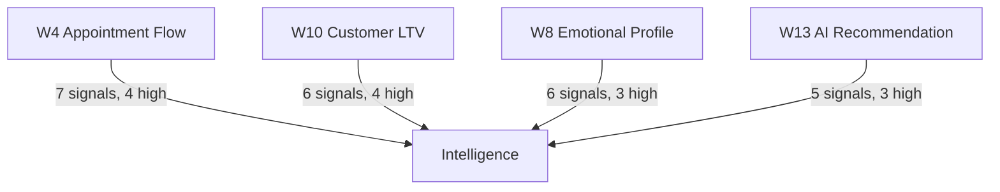
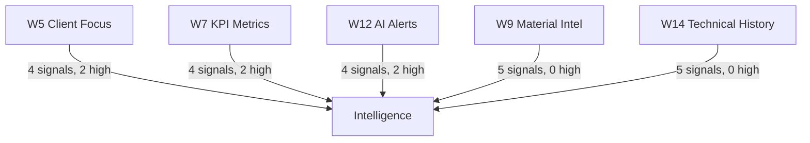
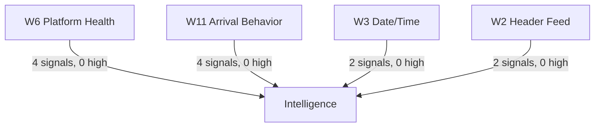

# HOME_INTELLIGENCE_SIGNALS.md — Widget Signals for Emotional Salon Intelligence

## Fecha
2026-05-29T23:41 UTC

## Fase
Phase 2.3 — Home Integration Plan (Planning Only — No Code Changes)

## Propósito
Identify which widgets generate useful signals for the Emotional Salon Intelligence system. This document categorizes every signal by widget, type, and priority. Intelligence is NOT implemented yet — this is a signal discovery document.

---

## Signal Categories

| Category | Description | Example |
|----------|-------------|---------|
| **Booking Interest** | Signals related to appointment demand, service selection, and scheduling patterns | Service popularity by day/hour |
| **Service Popularity** | Which services are most/least requested and by whom | Balayage Premium demand trend |
| **Client Engagement** | How clients interact with the salon — arrival, frequency, response | Repurchase rate, arrival punctuality |
| **Response Patterns** | How clients respond to recommendations, alerts, and communications | AI recommendation acceptance rate |
| **Follow-up Opportunities** | Signals that generate upsell, cross-sell, or retention actions | Client with low repurchase rate |
| **Salon Performance** | Business metrics that measure overall salon health | KPI trends, platform health |

---

## Widget Signal Map

### W1: Salon Hero
| Signal | Type | Priority | Notes |
|--------|------|----------|-------|
| *None* | — | — | Static branding. No data dependency. No useful signals. |

---

### W2: Header Feed
| Signal | Type | Priority | Notes |
|--------|------|----------|-------|
| Tip engagement (show/dismiss) | Client Engagement | 🔵 Low | Currently static tips. Future: if tips become dynamic and clickable, engagement data would be valuable |
| Tip effectiveness (appointment after tip shown) | Response Patterns | 🔵 Low | Future signal — requires linking tip display to subsequent staff actions |

**Current state:** No signals. All tips are static. Cannot generate Intelligence signals without dynamic feed.

---

### W3: Weather/Date/Time
| Signal | Type | Priority | Notes |
|--------|------|----------|-------|
| Visit time distribution | Booking Interest | 🟡 Medium | Real time tracking shows peak hours. Currently only `currentTime` state (30s interval). |
| Weather preferences (future) | Service Popularity | 🟢 Low | Future: if real weather API is added, could correlate services with weather (e.g., balayage on sunny days) |

**Current state:** Date/time is real. Time distribution can be logged. Weather is mock — no useful signal until real API.

---

### W4: Appointment Flow List
| Signal | Type | Priority | Notes |
|--------|------|----------|-------|
| Appointment created | Booking Interest | 🔴 High | Every new appointment is a booking signal. When created from Inbox → forwarded to Intelligence. |
| Appointment status change | Client Engagement | 🔴 High | Status transitions: created → confirmed → in_progress → completed → cancelled. Each transition is a signal. |
| Service selected | Service Popularity | 🔴 High | Which service was chosen, by which client, with which stylist. Core data for service trend analysis. |
| Stylist assigned | Salon Performance | 🟡 Medium | Stylist workload distribution. Useful for scheduling optimization. |
| Appointment cancelled | Client Engagement | 🔴 High | Cancellation patterns (which clients, which services, which times) are critical retention signals. |
| Appointment duration | Salon Performance | 🟡 Medium | Difference between scheduled duration and actual duration. Affects scheduling efficiency. |
| Client arrival status | Client Engagement | 🟡 Medium | Arrival on time, late, or no-show. Core for punctuality analytics. |

**Total signals: 7 — 4 high, 3 medium**

---

### W5: Client Focus Card
| Signal | Type | Priority | Notes |
|--------|------|----------|-------|
| AI recommendation displayed | Response Patterns | 🟡 Medium | When the client focus card shows AI recommendations to the stylist. |
| AI recommendation accepted | Response Patterns | 🔴 High | If stylist marks a recommendation as "used" or "accepted" — direct feedback for Intelligence. |
| Service upgrade opportunity | Follow-up Opportunities | 🔴 High | When the card implies an upsell (e.g., "add treatment to basic service"). |
| Client interaction during appointment | Client Engagement | 🟡 Medium | Derived from card viewing and interaction by the stylist. |

**Total signals: 4 — 2 high, 2 medium**

---

### W6: Platform Health Card
| Signal | Type | Priority | Notes |
|--------|------|----------|-------|
| Template rejection events | Salon Performance | 🟡 Medium | From `campaigns:meta-templates` localStorage — which templates were rejected. |
| Health score change | Salon Performance | 🟡 Medium | Every time health score recalculates to a different value. |
| Risk level change (high risk template) | Salon Performance | 🟡 Medium | When a template crosses from medium to high risk. |
| Compliance events | Salon Performance | 🟢 Low | Campaign compliance data from Campaign Safety Gate. |

**Total signals: 4 — 0 high, 3 medium, 1 low**

---

### W7: KPI Metrics Cards
| Signal | Type | Priority | Notes |
|--------|------|----------|-------|
| Sales today | Salon Performance | 🔴 High | Daily revenue. Trend over days/weeks/months. Critical for Intelligence trend analysis. |
| Revenue potential | Follow-up Opportunities | 🟡 Medium | Pending appointment revenue. Shows booking pipeline health. |
| Occupancy rate | Salon Performance | 🔴 High | Percentage of available slots filled. Core operational metric. |
| Period-over-period comparison | Salon Performance | 🟡 Medium | Week-over-week or month-over-month KPI changes. |

**Total signals: 4 — 2 high, 2 medium**

---

### W8: Emotional Profile
| Signal | Type | Priority | Notes |
|--------|------|----------|-------|
| Decision style (analytical/emotional/impulsive) | Client Engagement | 🔴 High | Core client preference data. Affects how to approach upsells and recommendations. |
| Response style (formal/casual/details-oriented) | Response Patterns | 🟡 Medium | Communication preference for WhatsApp conversations. |
| Ideal tone (professional/warm/friendly) | Response Patterns | 🟡 Medium | Affects AI Concierge tone selection. |
| Anxiety level | Client Engagement | 🔴 High | High-anxiety clients need different service approach. Important for retention. |
| Price sensitivity (low/medium/high) | Follow-up Opportunities | 🔴 High | Determines upsell strategy. Price-sensitive clients need value-based offers. |
| Visual validation preference | Response Patterns | 🟢 Low | Whether client prefers to see photos/examples before deciding. |

**Total signals: 6 — 3 high, 2 medium, 1 low**

---

### W9: Material Intelligence
| Signal | Type | Priority | Notes |
|--------|------|----------|-------|
| Average service cost | Salon Performance | 🟡 Medium | Client spending level. Segments clients by value. |
| Preferred brands | Service Popularity | 🟡 Medium | Which product brands the client uses. Inventory planning input. |
| Colorations used | Service Popularity | 🟡 Medium | Hair color trends. Frequency and type of color services. |
| Session time preference | Client Engagement | 🟡 Medium | How long the client typically spends in the salon. Scheduling input. |
| Margin per session | Salon Performance | 🟡 Medium | Profitability per client. Business Intelligence input. |

**Total signals: 5 — 0 high, 5 medium**

---

### W10: Customer Lifetime Value
| Signal | Type | Priority | Notes |
|--------|------|----------|-------|
| LTV calculation | Salon Performance | 🔴 High | Total value of client. Core segmentation metric. |
| Average ticket | Salon Performance | 🟡 Medium | Revenue per visit. Trend tracking. |
| Annual visits | Client Engagement | 🔴 High | Visit frequency. Retention metric. Declining visits = retention risk. |
| Repurchase rate | Client Engagement | 🔴 High | Percentage of clients who return. Direct retention metric. |
| LTV trend (increasing/decreasing) | Follow-up Opportunities | 🔴 High | LTV over time. Decreasing LTV triggers retention action. |
| Client value segment (low/medium/high) | Follow-up Opportunities | 🟡 Medium | VIP vs standard treatment. Resource allocation. |

**Total signals: 6 — 4 high, 2 medium**

---

### W11: Arrival Behavior
| Signal | Type | Priority | Notes |
|--------|------|----------|-------|
| Arrived on time | Client Engagement | 🟡 Medium | Reliability metric. On-time clients can be prioritized. |
| Arrived late | Client Engagement | 🟡 Medium | Lateness patterns. Affects scheduling buffer. |
| Arrival minutes offset | Client Engagement | 🟡 Medium | How early/late in minutes. Used for scheduling optimization. |
| Punctuality history | Client Engagement | 🟡 Medium | Aggregate punctuality trend over multiple visits. |

**Total signals: 4 — 0 high, 4 medium**

---

### W12: AI Alerts
| Signal | Type | Priority | Notes |
|--------|------|----------|-------|
| Alert type (retention/risk/opportunity) | Follow-up Opportunities | 🔴 High | Classification of alert. Determines action type. |
| Alert severity | Follow-up Opportunities | 🟡 Medium | How urgent the alert is. Prioritization. |
| Alert triggered (which condition) | Client Engagement | 🔴 High | What pattern caused the alert. Pattern detection input. |
| Alert resolution | Response Patterns | 🟡 Medium | Whether the stylist acted on the alert and outcome. |

**Total signals: 4 — 2 high, 2 medium**

---

### W13: AI Recommendation
| Signal | Type | Priority | Notes |
|--------|------|----------|-------|
| Recommendation type (upsell/cross-sell/retention) | Follow-up Opportunities | 🔴 High | What kind of offer was suggested. |
| Recommendation shown | Response Patterns | 🟡 Medium | Which recommendation was displayed to the stylist. |
| Recommendation accepted | Response Patterns | 🔴 High | Stylist accepted and used the recommendation. Direct effectiveness feedback. |
| Recommendation rejected | Response Patterns | 🟡 Medium | Stylist dismissed or ignored. Negative feedback for model improvement. |
| Post-recommendation service booked | Follow-up Opportunities | 🔴 High | Stylist → client accepted → service booked. Full conversion tracking. |

**Total signals: 5 — 3 high, 2 medium**

---

### W14: Technical History
| Signal | Type | Priority | Notes |
|--------|------|----------|-------|
| Tones used | Service Popularity | 🟡 Medium | Hair color tone selection trends. |
| Recent services | Service Popularity | 🟡 Medium | Service frequency by type. What each client typically books. |
| Stylist observations | Client Engagement | 🟡 Medium | Free-text notes. Future NLP input for preference mining. |
| Product preferences | Service Popularity | 🟡 Medium | Shampoo, conditioner, treatment preferences. Inventory input. |
| Service interval | Client Engagement | 🟡 Medium | How often client returns. Retention scheduling input. |

**Total signals: 5 — 0 high, 5 medium**

---

### W15: Technical Parameters
| Signal | Type | Priority | Notes |
|--------|------|----------|-------|
| *None* | — | — | Developer debug tool. Hidden by default. No business signals. |

---

## Signal Priority Summary

| Priority | Count | % |
|----------|:-----:|:-:|
| 🔴 High | 18 | 33% |
| 🟡 Medium | 33 | 60% |
| 🔵 Low | 4 | 7% |
| Total | 55 | 100% |

### Distribution by Signal Category

| Category | Signals | High | Medium | Low |
|----------|:-------:|:----:|:-----:|:---:|
| Client Engagement | 15 | 6 | 9 | 0 |
| Salon Performance | 10 | 4 | 6 | 0 |
| Follow-up Opportunities | 10 | 6 | 4 | 0 |
| Response Patterns | 10 | 2 | 7 | 1 |
| Service Popularity | 7 | 0 | 7 | 0 |
| Booking Interest | 3 | 2 | 1 | 0 |

**Total: 55 signals across 6 categories**

---

## Widgets Ranked by Signal Value

| Rank | Widget | Total Signals | High Priority | Intelligence Value |
|:----:|--------|:------------:|:-------------:|:------------------:|
| 1 | **W4 Appointment Flow** | 7 | 4 | Highest — core transactional data |
| 2 | **W8 Emotional Profile** | 6 | 3 | Very High — deep client understanding |
| 3 | **W10 Customer LTV** | 6 | 4 | Very High — value-based segmentation |
| 4 | **W13 AI Recommendation** | 5 | 3 | High — actionable AI output |
| 5 | **W9 Material Intel** | 5 | 0 | Medium — preference data |
| 6 | **W14 Technical History** | 5 | 0 | Medium — service history |
| 7 | **W5 Client Focus** | 4 | 2 | Medium — interaction point |
| 8 | **W7 KPI Metrics** | 4 | 2 | Medium — business health |
| 9 | **W6 Platform Health** | 4 | 0 | Medium-Low — operational |
| 10 | **W11 Arrival Behavior** | 4 | 0 | Low — punctuality tracking |
| 11 | **W12 AI Alerts** | 4 | 2 | Medium — risk detection |
| 12 | **W3 Date/Time** | 2 | 0 | Low — timing patterns |
| 13 | **W2 Header Feed** | 2 | 0 | Low — engagement tracking |
| 14 | **W1 Salon Hero** | 0 | 0 | None |
| 15 | **W15 Tech Parameters** | 0 | 0 | None |

---

## For Intelligence Pipeline (Future)

### Priority 1 — Wire these widgets first (most signal value):

### Priority 2 — Wire these next:

### Priority 3 — Wire when convenient:

---

## Key Insight

**W4 (Appointment Flow List) is the single most important widget for Intelligence.** It generates 4 high-priority signals across 3 categories (Booking Interest, Client Engagement, Service Popularity). Every appointment action — creation, status change, service selection, stylist assignment, cancellation — is a learning opportunity.

**W10 (Customer LTV)** and **W8 (Emotional Profile)** are the second most important, providing deep client understanding for segmentation and personalization.

**W13 (AI Recommendation)** is the only widget that provides direct feedback on AI effectiveness (accept/reject tracking), making it critical for the AI improvement loop.

---

## Status
✅ 55 Intelligence signals identified across 15 widgets.
✅ Signals categorized by type (6 categories) and priority (high/medium/low).
✅ Priority wiring order defined.
⏳ No implementation yet — ready for Phase 3 (Intelligence Pipeline) when the time comes.
